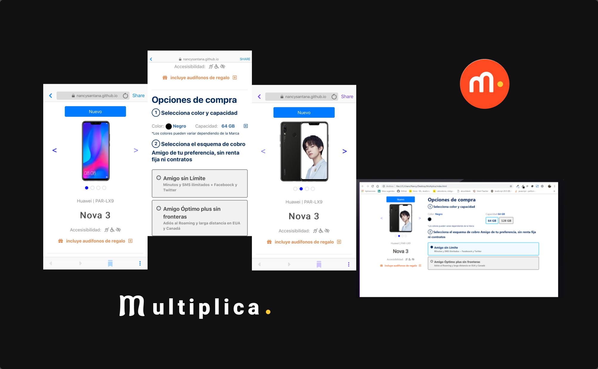
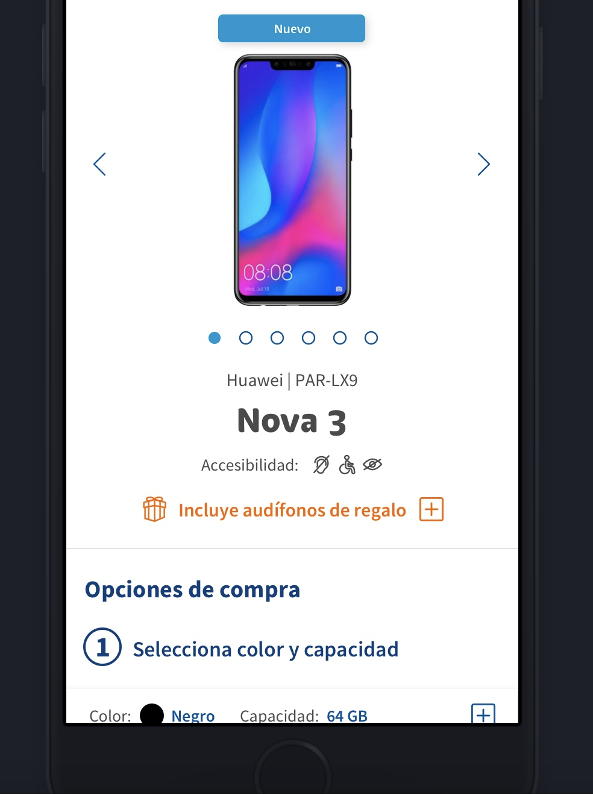

# Multiplica.

### Prueba Tecnica.

* La prueba consiste en maquetar los screenshots haciendo uso de HTML5 con un approach mobile first (adjunto ambos screensnhots).

* El resultado debe ser publicado en una liga de GitHub para poder ser revisado. Ademas de la publicación en el repositorio.

* Los colores los puedes obtener utilizando un color picker.

* Recomiendo el uso de SASS para manejar los estilos.

